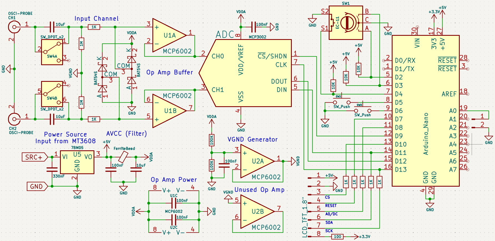
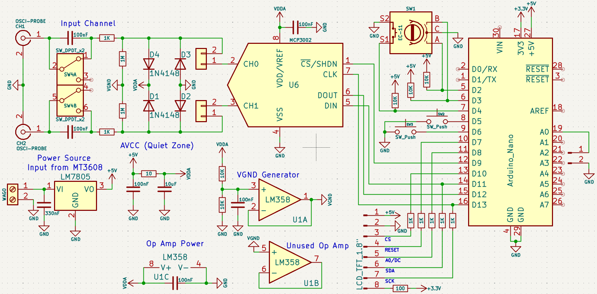

# 📈 Arduino Nano Dual-Channel Oscilloscope (DSO)

  

A high-performance, low-cost digital storage oscilloscope (DSO) built on the **Arduino Nano (ATmega328P)**.

This project pushes the limits of the 8-bit microcontroller to achieve a dual-channel display with a real-time sampling rate of ~100kSps+, featuring a custom "Smart Grid" rendering engine, advanced rotary encoder debouncing, and memory-optimized waveform buffers.

**Developed by:** WillsenSW

---

## ⚡ Key Features

### 🖥️ Display & Interface
* **Dual Channel Rendering:** Simultaneous visualization of CH1 (Yellow) and CH2 (Cyan).
* **1.8" TFT Display:** Uses the ST7735 driver with a high-speed SPI interface.
* **Smart Grid System:** A custom rendering algorithm that restores grid dots immediately after a waveform passes over them, preventing "disappearing grid" artifacts.
* **Aesthetic UI:** Smooth menu navigation with hover animations and a custom typewriter-style boot animation.

### ⚙️ Technical Capabilities
* **Variable Timebase:** 9 steps from **4µs/div** up to **2ms/div**.
* **Triggering:** Software-based trigger with selectable source (CH1 or CH2).
* **Measurements:** Real-time Vpp (Voltage Peak-to-Peak) and Frequency counter.
* **High-Impedance Input:** Uses **MCP6002 Rail-to-Rail Op-Amps** as input buffers to prevent signal loading.
* **Auto-Set:** One-click algorithm to find the best timebase for the current signal.

### 🛡️ Firmware Optimizations (V3.6)
* **8-Bit Memory Mapping:** Waveform data is compressed from 10-bit ADC values to 8-bit screen coordinates on the fly, saving ~40% RAM compared to standard implementations.
* **Anti-Crosstalk Input Logic:** A custom state machine that physically locks out button presses during rotary rotation to prevent mechanical vibration misclicks.
* **Direct Port Manipulation:** Uses high-speed SPI transactions to maximize frame rate.

---

## 🛠️ Hardware Required (Final Build)

| Component | Description | Quantity |
| :--- | :--- | :--- |
| **Microcontroller** | Arduino Nano (ATmega328P) | 1 |
| **Display** | 1.8" TFT LCD (ST7735) | 1 |
| **ADC** | MCP3002 (10-bit, 2-Channel SPI) | 1 |
| **Op-Amp** | **MCP6002** (Dual Channel Rail-to-Rail) | 2 |
| **Input Protection** | BAT54S Schottky Diodes | 2 |
| **Power Regulator** | 78M05 (5V LDO) | 1 |
| **Controls** | EC-11 Rotary Encoder & 2x Tactile Buttons | 1 set |
| **Misc** | Resistors (1K, 10K, 1M), Capacitors (10uF, 100nF) | - |

### 🔌 Pin Configuration

| Arduino Pin | Component Pin | Function |
| :--- | :--- | :--- |
| **D13** | SCK | SPI Clock (TFT & ADC) |
| **D12** | MISO | SPI Data In (ADC) |
| **D11** | MOSI | SPI Data Out (TFT & ADC) |
| **D10** | TFT CS | Display Chip Select |
| **D9** | ADC CS | ADC Chip Select |
| **D8** | TFT DC | Data/Command |
| **D7** | TFT RST | Reset |
| **D6** | BTN_MENU | Menu Toggle Button |
| **D5** | BTN_HOLD | Freeze Screen Button |
| **D4** | ENC_SW | Rotary Encoder Button |
| **D3** | ENC_DT | Encoder Pin B |
| **D2** | ENC_CLK | Encoder Pin A |
| **A0** | CAL_OUT | 1kHz Square Wave Output |

---

## 📐 Schematics

This repository includes both the initial prototype design and the finalized buffered version.

### Final Product (Recommended)
The final version includes **MCP6002** Op-Amp buffers for high input impedance and **BAT54S** clamping diodes for better protection. It also uses larger **10uF** coupling capacitors for better low-frequency response.

### Prototype
The initial proof-of-concept using direct coupling.

---

## 💾 Installation & Setup

1.  **Dependencies:** Install the following libraries via the Arduino Library Manager:
    * `Adafruit_GFX`
    * `Adafruit_ST7735`
2.  **Hardware Setup:** Wire the components according to the **Final** schematic above. *Note: Ensure your EC-11 encoder common pin is connected to GND.*
3.  **Flash:** Open the `.ino` file in Arduino IDE, select `Arduino Nano` (Processor: ATmega328P Old Bootloader), and upload.
4.  **Calibration:**
    * Connect your probe to pin **A0** (Calibration Output).
    * You should see a clean 1kHz square wave.
    * Adjust your physical probe's trimmer capacitor until the square wave corners are sharp (not rounded).

---

## 🎮 Controls

The oscilloscope is controlled entirely via the Rotary Encoder and two auxiliary buttons:

| Action | Control | Function |
| :--- | :--- | :--- |
| **Change Value** | Rotate Knob | Adjusts Time/Div, Probe Scale, or Trigger Source. |
| **Change Focus** | Click Knob | Cycles selection between Timebase, Probe, and Trigger. |
| **Open Menu** | Menu Button | Opens the overlay menu to toggle Channels or run Autoset. |
| **Freeze** | Hold Button | Pauses the display (Hold Mode) for analysis. |

---

## 🧠 Memory Optimization Note
The ATmega328P only has 2KB of RAM. To prevent stack overflows while using the heavy GFX library:
1.  **Text in Flash:** All static UI strings use the `F()` macro to store text in PROGMEM.
2.  **Buffer Compression:** We do not store raw ADC values. The ADC data is immediately mapped to screen Y-coordinates (uint8_t) before storage, reducing buffer size by half compared to storing integers.

---

## 📜 License
This project is open-source. Feel free to fork, modify, and use it for your own educational projects.

**Credits:**
* Project Lead & Firmware: **WillsenSW**
